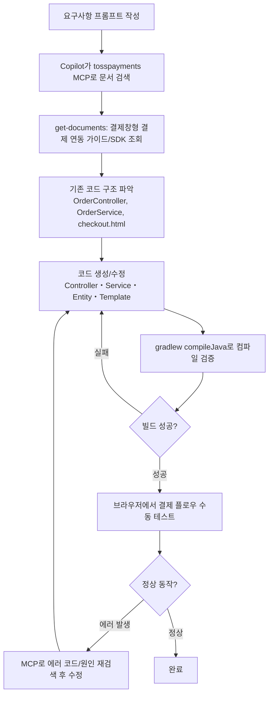
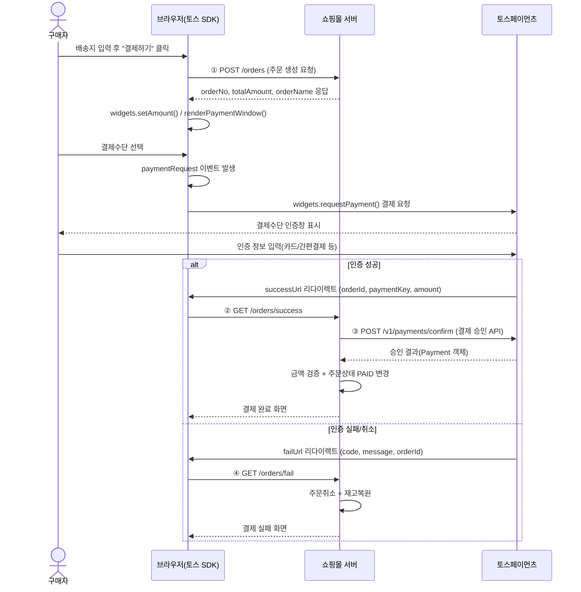
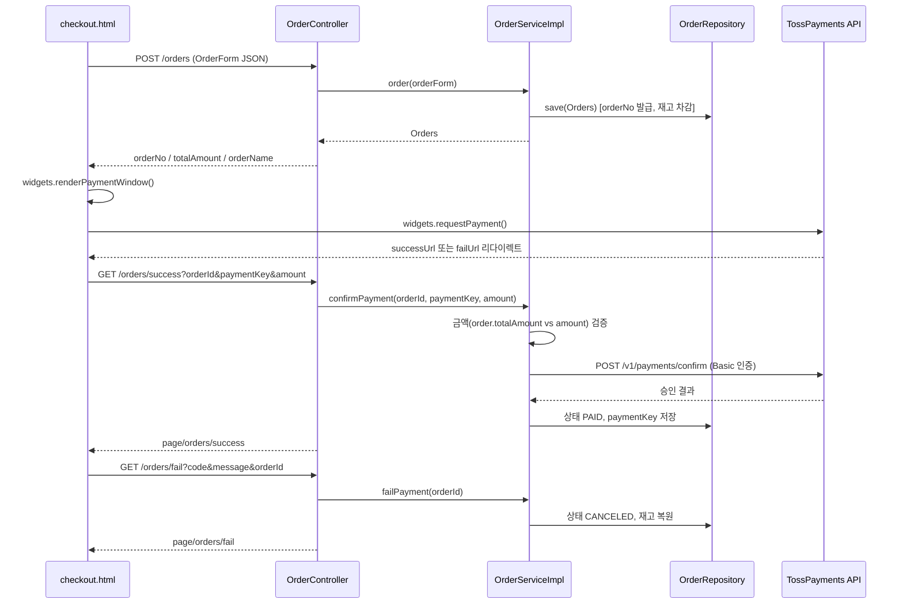

# 10. 결제 (토스페이먼츠 결제창형 결제 연동)

## 1. 개요

이 프로젝트는 **토스페이먼츠 결제창형 결제**(Payment Window)를 사용합니다.
주문서(배송지 입력) 화면에서 "결제하기"를 누르면 결제수단을 고르는 **결제창이 팝업/오버레이로 열리고**, 결제 요청 → 인증 → 승인 과정을 거쳐 주문이 완료됩니다.

| 연동 방식 | 설명 | 채택 여부 |
| --- | --- | --- |
| 주문서형 결제 | 주문서 페이지 안에 결제 UI를 직접 렌더링 | ❌ |
| **결제창형 결제** | 결제하기 버튼 클릭 시 결제창을 팝업/오버레이로 호출 | ✅ (본 프로젝트) |
| 자체창형 결제 | 카드사·간편결제사 자체창을 직접 호출 (UI 직접 개발) | ❌ |

---

## 2. 토스페이먼츠 MCP 연동 가이드

[토스페이먼츠 통합 가이드 MCP](https://www.npmjs.com/package/@tosspayments/integration-guide-mcp) 서버를 VS Code에 등록하면, Copilot Chat이 토스페이먼츠 공식 문서를 실시간으로 조회하면서 연동 코드를 작성할 수 있습니다.

### 2.1 MCP 서버 등록 (`.vscode/mcp.json` 또는 사용자 설정)

```json
{
  "servers": {
    "tosspayments-integration-guide": {
      "command": "npx",
      "args": ["-y", "@tosspayments/integration-guide-mcp@latest"]
    }
  }
}
```

### 2.2 등록 절차

| 순서 | 작업 | 설명 |
| --- | --- | --- |
| 1 | 명령 팔레트 실행 | `Ctrl+Shift+P` → `MCP: Add Server` |
| 2 | 서버 종류 선택 | `Command (stdio)` 선택 |
| 3 | 실행 명령 입력 | `npx -y @tosspayments/integration-guide-mcp@latest` |
| 4 | 이름 지정 | `tosspayments-integration-guide` |
| 5 | 저장 위치 선택 | Workspace(`.vscode/mcp.json`) 또는 사용자 설정 |
| 6 | 서버 시작 | mcp.json 상단의 `Start` 코드렌즈 클릭 |

### 2.3 MCP가 제공하는 도구

| 도구 | 용도 |
| --- | --- |
| `get-documents` | 키워드로 연동 가이드/SDK/레퍼런스 문서 검색 (v1, v2) |
| `get-glossary-documents` | 결제 용어·정책 사전 검색 (에스크로, 면세 등) |
| `document-by-id` | 검색 결과의 문서 ID로 원문 전체 조회 |

---

## 3. VS Code Copilot + 토스 MCP 프롬프트 가이드

### 3.1 실제 사용한 프롬프트

```text
'mcp_tosspayments-_document-by-id'
토스페이먼츠 MCP 를 사용해서
결제창형 결제를 연동해서 만들어진 주문서페이지에 적용해줘
#file:OrderController.java
를 이용해서 결제 성공, 실패 화면도 생성해서 요청경로 매핑해줘

C:\...\shop\src\main\resources\templates\page\orders 경로로
#file:base.html 를 복사해서 success.html, fail.html 를 생성해

결제 승인이랑 나머지는 알아서 해
```

### 3.2 프롬프트 작성 포인트

| 포인트 | 설명 |
| --- | --- |
| MCP 도구 명시 | `#mcp_tosspayments-_document-by-id` 처럼 특정 도구를 직접 언급해 최신 공식 문서를 우선 조회하도록 유도 |
| 대상 파일 첨부 | `#file:OrderController.java`, `#file:base.html` 로 기존 코드 스타일·구조를 그대로 따르게 함 |
| 결과물 경로 지정 | 생성 위치를 절대경로로 명확히 지정 |
| 범위 위임 | "결제 승인이랑 나머지는 알아서 해" 처럼 세부 구현은 AI 판단에 위임하되, 핵심 제약(성공/실패 화면, 매핑)은 명시 |

### 3.3 AI 적용 워크플로우



---

## 4. 결제 프로세스 전체 흐름 (일반론)

### 4.1 단계 요약

| 단계 | 주체 | 설명 |
| --- | --- | --- |
| 1. 주문 생성 | 쇼핑몰 서버 | 결제 전, 주문 정보(배송지·금액·상품)를 먼저 저장하고 `orderId` 발급 |
| 2. 결제창 호출 | 브라우저(SDK) | `widgets.renderPaymentWindow()` 로 결제창을 오픈 |
| 3. 결제 요청 | 브라우저(SDK) | 구매자가 결제수단 선택 → `paymentRequest` 이벤트 → `widgets.requestPayment()` |
| 4. 인증 리다이렉트 | 토스페이먼츠 | 인증 성공 시 `successUrl`, 실패 시 `failUrl` 로 이동 |
| 5. 결제 승인 | 쇼핑몰 서버 | `successUrl`에서 받은 `paymentKey`·`orderId`·`amount`로 **결제 승인 API** 호출 |
| 6. 완료 처리 | 쇼핑몰 서버 | 승인 성공 시 주문 상태를 결제완료로 변경, 실패 시 주문취소 + 재고복원 |

### 4.2 전체 시퀀스 다이어그램



---

## 5. 현재 쇼핑몰 프로젝트 적용 흐름

### 5.1 구성 요소

1. 엔터티
  - Orders.java              (주문정보 + `orderNo`, `paymentKey` 추가)
  - OrderItem.java           (주문항목)

2. Enum
  * OrderStatus              (ORDERED → **PAID** → SHIPPING → DELIVERED / CANCELED)

3. 레포지토리
  - OrderRepository.java     (JPA, `findByOrderNo` 추가)

4. 서비스
  - OrderService.java / OrderServiceImpl.java
    - `order()`            : 상품번호 유무로 바로구매/장바구니 주문 분기 생성
    - `confirmPayment()`   : 결제 승인 API 호출 + 금액 검증
    - `failPayment()`      : 주문취소 + 재고복원

5. 컨트롤러
  * /orders
  - OrderController.java
    - `tossClientKey`, `customerKey` 를 모델에 전달

6. 뷰
  - 주문서 작성 : page/orders/checkout.html (토스 SDK 스크립트 + 결제창 호출 스크립트)
  - 결제 성공   : page/orders/success.html
  - 결제 실패   : page/orders/fail.html

### 5.2 요청 매핑

| 메소드 | URL | 설명 |
| --- | --- | --- |
| GET | `/orders/checkout` | 장바구니 기반 주문서 화면 |
| GET | `/orders/checkout/direct` | 상품상세 바로구매 주문서 화면 |
| **POST** | `/orders` | 결제 전 주문 생성 (AJAX, JSON) → `{orderNo, orderName, totalAmount, customerName, customerEmail}` 응답 |
| **GET** | `/orders/success` | 토스페이먼츠 `successUrl`. 결제 승인 API 호출 후 `success.html` 렌더링 |
| **GET** | `/orders/fail` | 토스페이먼츠 `failUrl`. 주문취소/재고복원 후 `fail.html` 렌더링 |

### 5.3 프로젝트 적용 시퀀스 (클래스 기준)



### 5.4 주요 설정값 (`application.properties`)

```properties
# 토스페이먼츠 (결제창형 결제) - 회원가입 없이 사용 가능한 문서용 테스트 키
tosspayments.client-key=test_gck_docs_Ovk5rk1EwkEbP0W43n07xlzm
tosspayments.secret-key=test_gsk_docs_OaPz8L5KdmQXkzRz3y47BMw6
```

> ⚠️ 실제 서비스 배포 전에는 [토스페이먼츠 개발자센터](https://developers.tosspayments.com/my/api-keys)에서 발급받은 상점 전용 키로 교체해야 합니다. 시크릿 키는 서버(`OrderServiceImpl`)에서만 사용하고, 클라이언트 키만 화면(`checkout.html`)에 노출됩니다.

### 5.5 검증/보안 포인트

| 항목 | 구현 위치 | 설명 |
| --- | --- | --- |
| 금액 위변조 검증 | `OrderServiceImpl.confirmPayment()` | 저장된 `totalAmount`와 리다이렉트로 받은 `amount`가 다르면 승인 거부 + 주문취소 |
| 구매자 식별키(customerKey) | `OrderController.generateCustomerKey()` | 회원번호를 그대로 쓰지 않고 `UUID.nameUUIDFromBytes()`로 변환해 유추 불가능하게 생성 |
| 시크릿 키 노출 방지 | `OrderServiceImpl` | 시크릿 키는 서버 코드에서만 사용(`@Value`), 결제 승인 API도 서버에서만 호출 |
| CSRF 토큰 | `layouts/main_layout.html` + `static/js/ajax.js` | 메타태그로 내려온 CSRF 토큰을 모든 AJAX 요청 헤더에 자동 첨부 |
| 결제 실패/취소 복구 | `OrderServiceImpl.failPayment()` | 승인 실패·구매자 취소 시 주문상태 CANCELED, 차감했던 재고 원복 |
